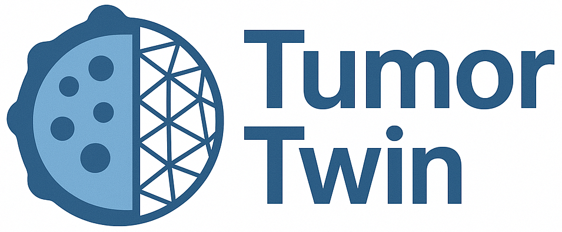

[](./LICENSE.md)
[](https://www.python.org)
[](https://black.readthedocs.io/en/stable/)
[](https://github.com/OncologyModelingGroup/TumorTwin/issues)

## 
`TumorTwin` is a python framework for creating image-guided cancer-patient digital twins (CPDTs). It includes functionality for:
1. Loading and handling patient datasets, including treatment data and multi-modal longitudinal MRI data.
2. Simulating tumor growth and response to treatment.
3. Computing sensitivities of model output quantities of interest with respect to model parameters
4. Calibrating model parameters to longitudinal MRI data.

## Quick start
To jump right in, click a badge below to launch one of our tutorial notebooks in Google Colab:

**High-grade glioma (HGG) Demo:**

[](https://colab.research.google.com/github/OncologyModelingGroup/TumorTwin/blob/main/tutorials/HGG_Demo.ipynb)

**Triple-negative breast cancer (TNBC) Demo**:

[](https://colab.research.google.com/github/OncologyModelingGroup/TumorTwin/blob/main/tutorials/TNBC_Demo.ipynb)

## Full Documentation

For installation instructions, tutorials, and full API reference check out out the [complete documentation here.](https://OncologyModelingGroup.github.io/TumorTwin)

## License

This package is released under a UT Austin Research license. Commercial use is prohibited without prior permission from UT Austin. See [LICENSE.md](./LICENSE.md) for more details.

## Technical Report
For a full discussion of the motivation, design principles, and underlying theory of `TumorTwin`, please refer to the complete technical report (available freely on [arXiv](https://arxiv.org/abs/2505.00670))

## References
If you find this library useful in your research, please consider citing the following references:
#### TumorTwin Paper
```
@misc{tumortwin-report,
	title = {TumorTwin: A python framework for patient-specific digital twins in oncology},
	author = {Michael Kapteyn and Anirban Chaudhuri and Ernesto A. B. F. Lima and Graham Pash and Rafael Bravo and Karen Willcox and Thomas E. Yankeelov and David A. Hormuth II},
	year  = 2025,
	eprint = {arXiv:2505.00670}
}
```
#### TumorTwin Codebase
```
@misc{tumortwin-code,
	author={Kapteyn, Michael G. and Chaudhuri, Anirban and Lima, Ernesto A.B.F. and Pash, Graham and Bravo, Rafael and Yankeelov, Thomas E. and Willcox, Karen and Hormuth II, David A.},
	title={TumorTwin},
	year={2025},
	url={https://github.com/OncologyModelingGroup/TumorTwin},
}
```
